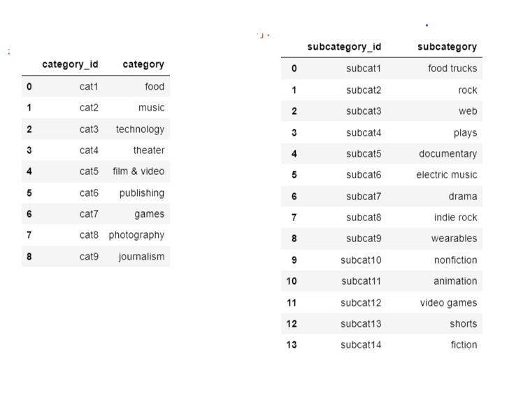
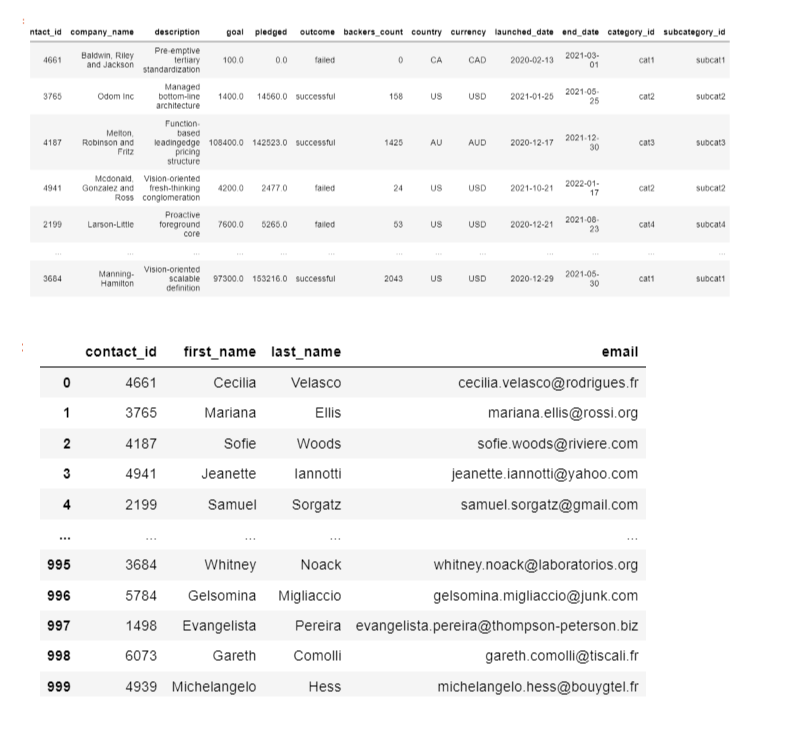
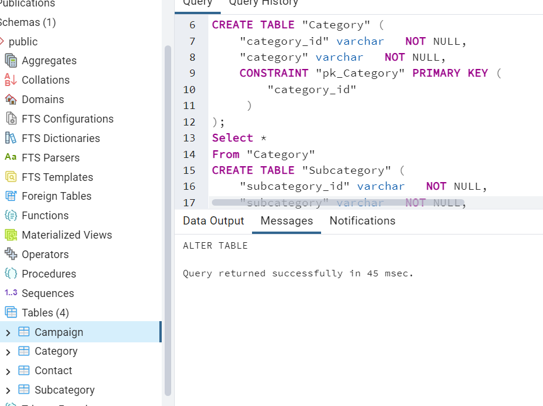

# Project_2
# Project Title: Crowdfunding_ETL
 By Natalie Shiri, Neivethan , Suwaiba Idris

 ## Purpose of the Project
 In this project we had to build an ETL pipeline using  a Crowdfunding data using Pandas, Python and Python dictionaries.

 ### Extraction
 We had two set of data in the form of excel sheets which we extracted using Pandas

 ### Transformation
 From the above data we extracted  and created four tables (Contacts, Campaign, Category and Subcategory). We performed data cleaning on the tables using a variety of Python and Pandas data manipulation tools and extracted them as CSVs.

 We created ERD tables for each of the four CSV files ensuring that we established all constraints (primary keys and foriegn keys) and exported it as postgres file.

 ### Loading
 The ERD table was then imported on to PG Admin and 
 the data from the CSV files was loaded onto the tables.

 

